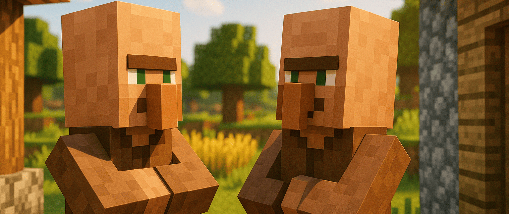

<div align="center"></div>
<h3 align="center">A Forge-based mod that integrates GPT into Minecraft</h3>
<div align="center"></div>

------------------------------
# Mine Chat

Now you could chat with villager in minecraft with a simple config, just face to them and texting.
### 🏷️ Version Compatibility

- **Minecraft**: `1.20.4`
- **Forge**: `49.1.0` ~ `49.2.0`
- Supports both **client** and **server** sides.

### ⚙️ Basic Configuration

Edit the configuration file located at `config/minechat-common.toml`. The following parameters are required:

|Name|Description|
|---|---|
|`gpt_api`|Model URL compatible with the OpenAI API format|
|`gpt_key`|API key for accessing the model|
|`gpt_model`|Name of the model to be used|

Additionally, you can define custom prompts for villagers of different professions, or specify a default prompt to be shared among them. Please refer to the comments in the configuration file for available parameters.

> 💡 **Tip**: In multiplayer mode, configuring the server alone is sufficient.

### 🔐 Authorization Manage

You can configure the mod by editing the configuration file, including adding blacklist/whitelist entries, enabling the whitelist, and activating the mod.

```toml
[authorization]
    #Player white list
    white_list = ["Steve", "Alex"]
    #Player black list. Specify the list of player names to block from interacting with entities (villagers)
    black_list = []
    #Allow entities to speak or not. If false, entities will not speak with you
    mod_enabled = true
    #Use white list or not. If True, only the players who on the white_list can chat with entities (villager)
    use_white_list = false
```

> 📝 When the whitelist is enabled, only players listed in the whitelist are allowed to use the AI entity chat feature.